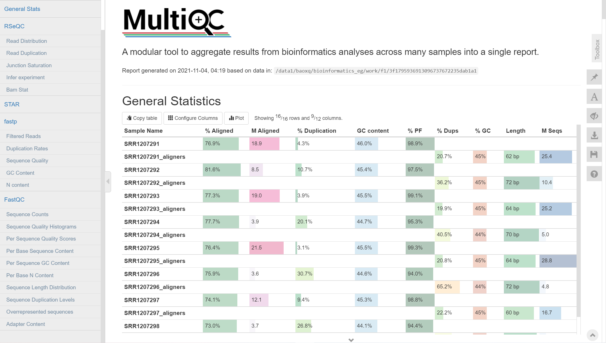
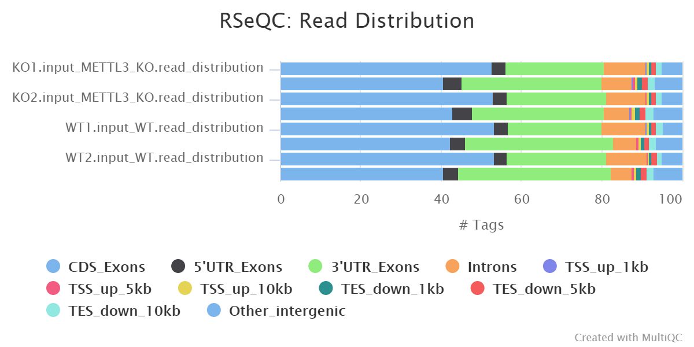
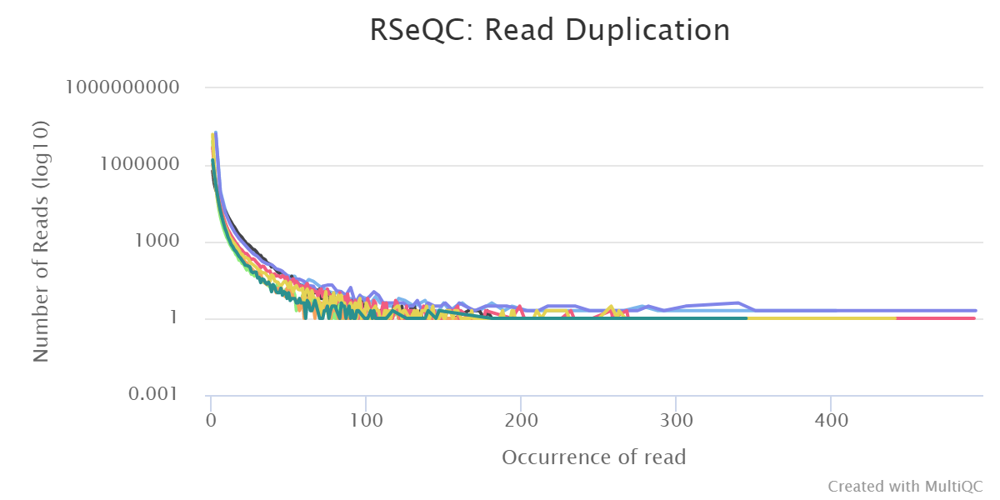
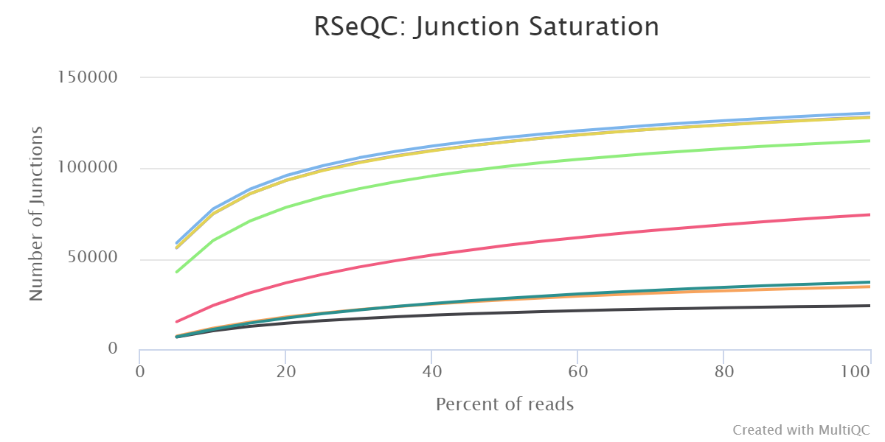
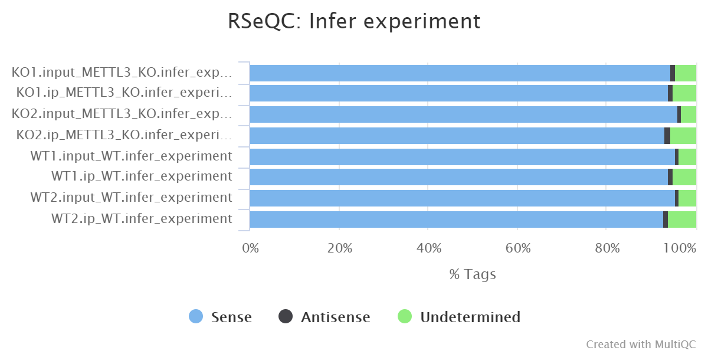
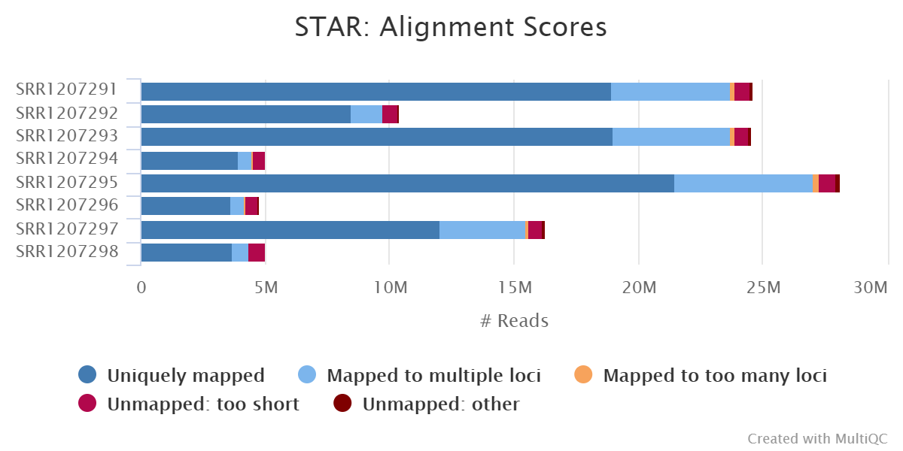
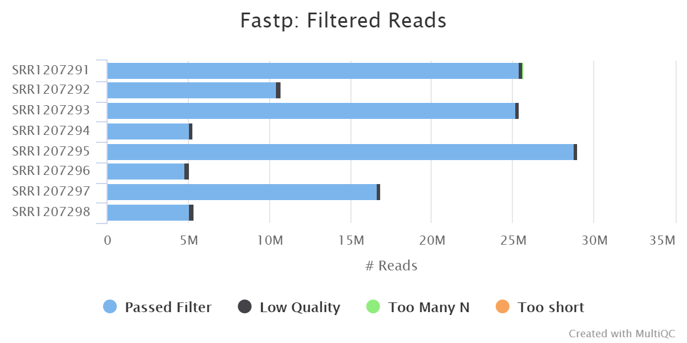
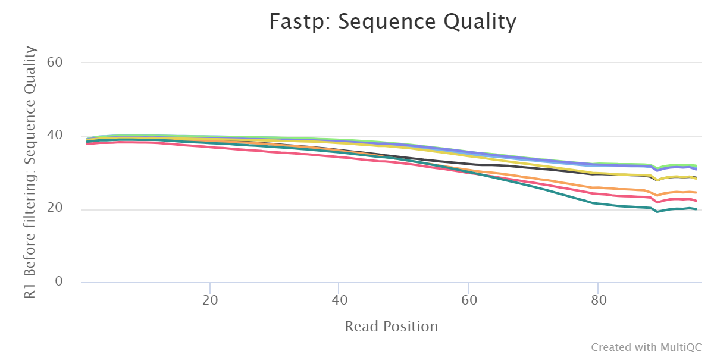
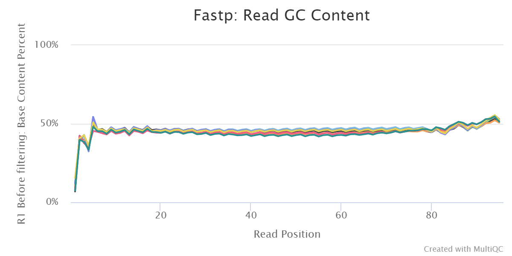
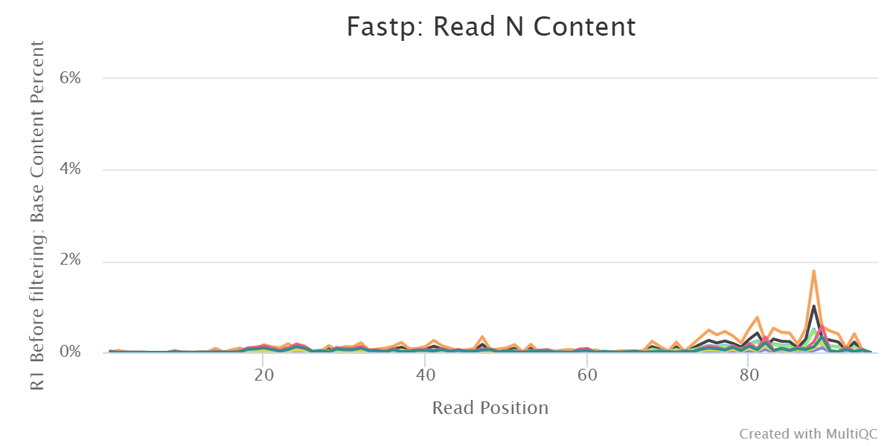

# MeRIPseqPipe: Output

This document describes the output produced by the pipeline.  

The MeRIP-seq data for the illustration of MeRIPseqPipe was downloaded from GEO dataset: [GSE52662](https://www.ncbi.nlm.nih.gov/geo/query/acc.cgi?acc=GSE52662) (*Mus musculus*) , which was used to describe the dynamic m6A RNA modification during cell fate transition in mammalian embryonic stem cells.

All the results showed below are come from defaulted tools and options:

```bash
  // Setting main parameters of analysis mode
  stranded = "no"
  single_end = true
  gzip = true
  mapq_cutoff = 20
  motiflength = "5,6,7,8"
  featurecount_minMQS = "0"
  delfc = "0.58"
  dmlfc = "0.58"
  cluster_method = "single"
  aligners = "star"
  peak_threshold = "medium"
  peakCalling_mode = "independence"
  peakMerged_mode = "rank"
  expression_analysis_mode = "DESeq2"
  methylation_analysis_mode = "QNB"
  skip_createbedgraph = true
```

## Structure of the result folder

All the necessary files are output in the pipe result folder, users can use these files for further analysis based on according to different analysis needs.

* QC
  * fastp
    1. *._aligners.fastq.gz
    2. *._fastp.html
    3. *._fastp.json
  * fastqc
    1. *._aligners_fastqc.html
    2. *._aligners_fastqc.zip
  * rseqc
    * bam_stat
    * infer_experiment
    * inner_distance
    * junction_annotation
    * junction_saturation
    * read_distribution
    * read_duplication
* alignment
  * rRNA_dup
    1. *.fastq.gz
    2. *._rRNA_summary.txt
  * star
    1. *Log.final.out
    2. *_star.bam
  * samtoolsSort
    1. groupid_sampleid.bam
* expressionAnalysis
  * featurecounts
    1. expression.*.count.matrix
    2. expression.*.fpkm.matrix
    3. expression.*.tpm.matrix
    4. featurecount_*.input.count
  * DESeq2
    1. DESeq2_*.csv
* peakCalling
  * macs2
    1. *_normalized.bed
    2. *_peaks.narrowPeak
    3. *_peaks.xls
    4. *.summits
  * MATK
    1. *.bed
    2. *_normalized.bed
  * metpeak
    1. *_normalized.bed
  * meyer
    1. *.bed
    2. *_normalized.bed
  * mergedBed
    1. rank_merged_allpeaks.bed
    2. rank_merged_group_*.bed
    3. rank_merged_sample_*.bed
* m6AAnalysis
  * AnnotatedPeaks
    * annotatedbygtf
      1. peakcaller*_normalized.anno.txt
      2. peakcaller*_normalized.peak_bed.center
      3. peakcaller*_normalized.refSeq.all.bed
      4. peakcaller*_normalized.tmp.refSeq.bed
      5. peakcaller*_normalized.unanno.txt
    * *_normalized_annotatedbyhomer.bed
  * diffm6A
    1. tool_diffm6A_*.txt
  * m6APredictionSites
    1. m6A_sites_merged.bed
    2. m6A_sites_group*.bed
  * m6AQuantification
    1. *_quantification.matrix
    2. *.input.count
    3. *.ip.count
  * motif
    * rank_merged*_homer
* Report
  * diffReport
  * PeaksMotifReport
  * QCReadsReport
  * ReportRData
* pipeline_info

## Report

### Quality Control and Alignment

**Output directory:** **`results/Report/QCReadsReport`**

[MultiQC](http://multiqc.info) is a visualisation tool that generates a single HTML report summarising all samples in your project. Most of the pipeline QC results are visualised in the report and further statistics are available in within the report data directory.






















