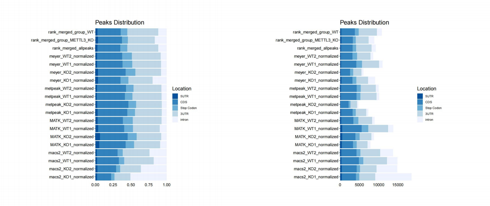
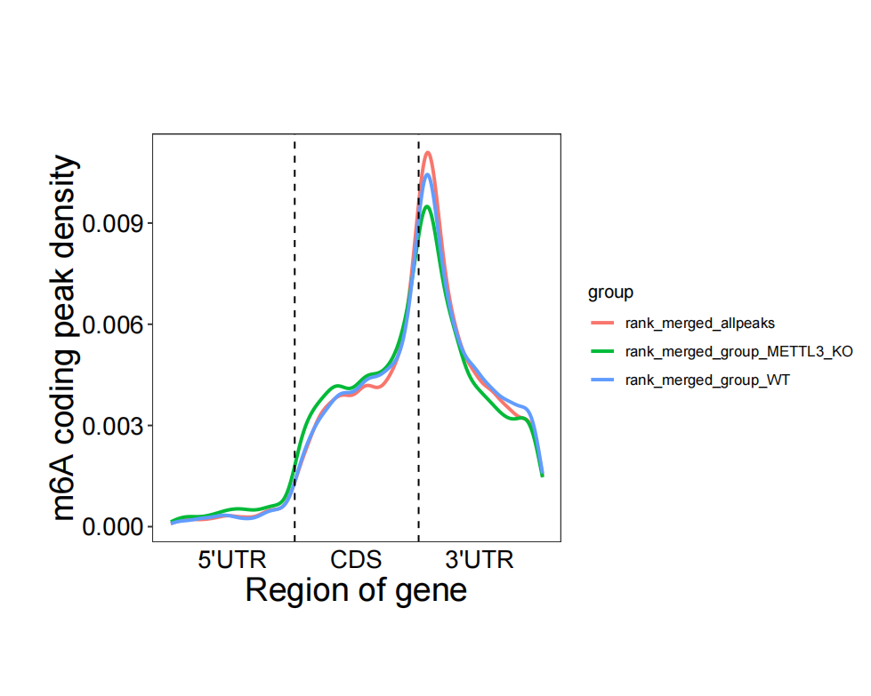
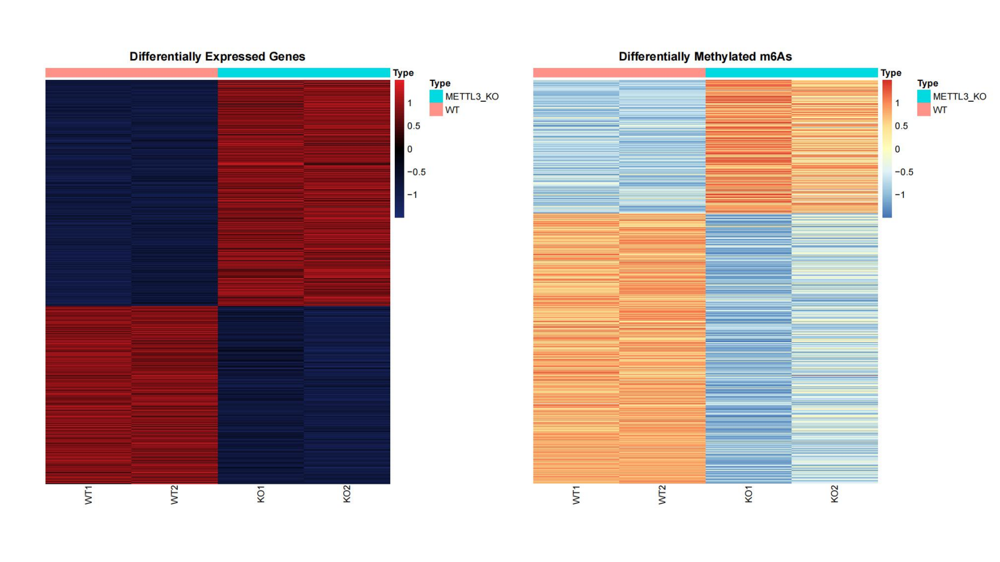
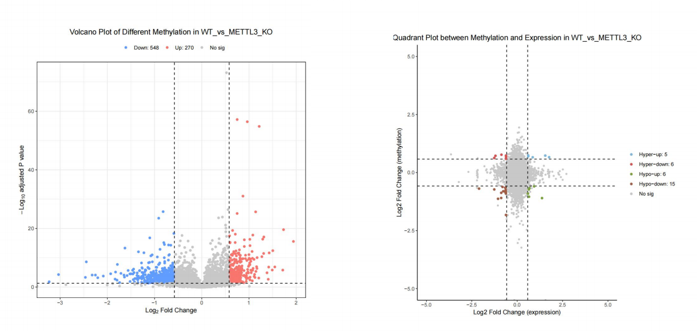
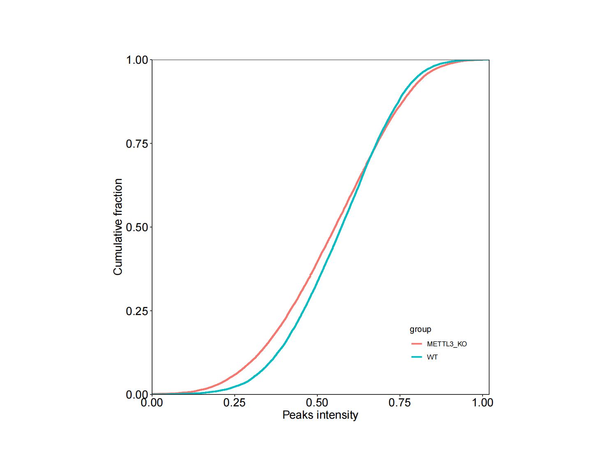

# MeRIPseqPipe: Output

This document describes the output produced by the pipeline.  

The MeRIP-seq data for the illustration of MeRIPseqPipe was downloaded from GEO dataset: [GSE52662](https://www.ncbi.nlm.nih.gov/geo/query/acc.cgi?acc=GSE52662) (*Mus musculus*) , which was used to describe the dynamic m6A RNA modification during cell fate transition in mammalian embryonic stem cells.

All the results showed below are come from defaulted tools and options:

```bash
  // Setting main parameters of analysis mode
  stranded = "no"
  single_end = true
  gzip = true
  mapq_cutoff = 20
  motiflength = "5,6,7,8"
  featurecount_minMQS = "0"
  delfc = "0.58"
  dmlfc = "0.58"
  cluster_method = "single"
  aligners = "hisat2"
  peak_threshold = "medium"
  peakCalling_mode = "independence"
  peakMerged_mode = "rank"
  expression_analysis_mode = "DESeq2"
  methylation_analysis_mode = "QNB"
  skip_createbedgraph = true
```

## Structure of the result folder

All the intermediate files are output in the pipe result folder, users can use these files for further analysis based on different analysis needs.

* **QC**
  * fastp
    1. `*._aligners.fastq.gz`
    2. `*._fastp.html`
    3. `*._fastp.json`
  * fastqc
    1. `*._aligners_fastqc.html`
    2. `*._aligners_fastqc.zip`
  * rseqc
    * bam_stat
    * infer_experiment
    * inner_distance
    * junction_annotation
    * junction_saturation
    * read_distribution
    * read_duplication
* **alignment**
  * rRNA_dup
    1. `*.fastq.gz`
    2. `*._rRNA_summary.txt`
  * hisat2 (or other aligner)
    1. `*_hisat2.bam`
    2. `*_hisat2_summary.txt`
  * samtoolsSort
    1. `groupid_sampleid.bam`
* **expressionAnalysis**
  * featurecounts
    1. `expression.*.count.matrix`
    2. `expression.*.fpkm.matrix`
    3. `expression.*.tpm.matrix`
    4. `featurecount_*.input.count`
  * DESeq2 (or edgeR)
    1. `DESeq2_*.csv`
* **peakCalling**
  * macs2
    1. `*_normalized.bed`
    2. `*_peaks.narrowPeak`
    3. `*_peaks.xls`
    4. `*.summits`
  * MATK
    1. `*.bed`
    2. `*_normalized.bed`
  * metpeak
    1. `*_normalized.bed`
  * meyer
    1. `*.bed`
    2. `*_normalized.bed`
  * mergedBed (or other peak merging tools)
    1. `rank_merged_allpeaks.bed`
    2. `rank_merged_group_*.bed`
    3. `rank_merged_sample_*.bed`
* **m6AAnalysis**
  * AnnotatedPeaks
    * annotatedbygtf
      1. `peakcaller*_normalized.anno.txt`
      2. `peakcaller*_normalized.peak_bed.center`
      3. `peakcaller*_normalized.refSeq.all.bed`
      4. `peakcaller*_normalized.tmp.refSeq.bed`
      5. `peakcaller*_normalized.unanno.txt`
    * `*_normalized_annotatedbyhomer.bed`
  * diffm6A
    1. `analysistool_diffm6A_*.txt`
  * m6APredictionSites
    1. `m6A_sites_merged.bed`
    2. `m6A_sites_group*.bed`
  * m6AQuantification
    1. `*_quantification.matrix`
    2. `*.input.count`
    3. `*.ip.count`
  * motif
    * rank_merged*_homer
* **Report**
  * diffReport
  * PeaksMotifReport
  * QCReadsReport
  * ReportRData
* **pipeline_info**
  * execution_report.html
  * execution_timeline.html
  * pipeline_report.html

## Report

### Quality Control & Alignment

​ The quality of RNA sequencing data can be assessed at two different levels, sequence-based and alignment-based metrics. The former includes the sequence quality, sequencing depth, reads duplication rates, GC content, and nucleotide composition bias, while the latter contains mapping statistics, coverage uniformity, saturation of sequencing depth, reads distribution over gene structure, and ribosomal RNA contamination.

​ MeRIPseqPipe combined three quality control tools including fastp, FastQC and RseQC, which can cover most of sequence-based and alignment-based quality control metrics.
​ For alignment, three popular tools, HISAT2, STAR and BWA are in support.

​ All the results are be summarized with MultiQC in a comprehensive HTML report.

**Output directory:** **`results/Report/QCReadsReport`**

​ [MultiQC](http://multiqc.info) is a visualisation tool that generates a single HTML report summarising all samples in your project. Most of the pipeline QC results are visualised in the report and further statistics are available in within the report data directory.


* `QCReadsReport/multiqc_report_hisat2_data`: containing statistics data files
* `QCReadsReport/multiqc_report_hisat2.html`: check [multiqc_report_hisat2.html](#reports/QCReadsReport/multiqc_report_hisat2.html) for the full report.

### Peak & Motif

​ MeRIPseqPipe will call m6A peaks on the preprocessed bam files using MACS2, MeTPeak, Meyer and MATK. Users can adjust to meet different needs.

  The results of peak distribution and motif will be plotted and generated in the [Peaks_Motif_Report_rank.html](#reports/PeaksMotifReport/Peaks_Motif_Report_rank.html).

**Output directory:** **`results/Report/PeaksMotifReport`**

**Three types of plots will be output for visualization:**

1. The percentage of peaks in different genome regions
  
2. the peak density over 5'UTR, CDS and 3'UTR of mRNAs
   m6A sites  are significantly enriched near the stop codon and beginning of the 3'UTR of protein coding genes.
  
3. the top three significant motifs of every group detected by HOMER
   ​The sequence motifs have biological significance. As for m6A modification, it mostly occurs at RRACH motif (R denotes A or G, H denotes A, C, or U).
  
**Note:** all the plots are saved as PDF format in the output directory.

### Differential analysis

​ MeRIPseqPipe uses DESeq2 and edgeR to perform differential expression analysis and implements five algorithms including Wilcox-test, QNB, MATK, DESeq2 (GLM) and edgeR (GLM) to perform quantification and differential methylation analysis.

**Output directory:** **`results/Report/diffReport`**

​ All the plots are generated in the [DiffReport_rank_QNB_DESeq2.html](#reports/diffReport/DiffReport_rank_QNB_DESeq2.html)

**Heatmap, volcano plot, quadrant plot and ecdf curve are output for visualization:**

1. Heatmap of differentially expressed genes and methylated m6As.
  
2. Volcano plot of differentially methylated m6As and quadrant plot between differentially expressed genes and methylated m6As.
  
3. the ECDF curve of different groups
  
